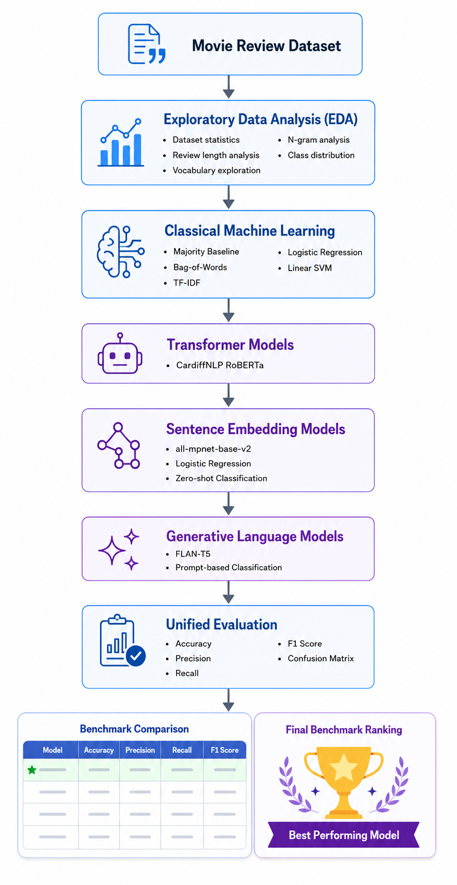
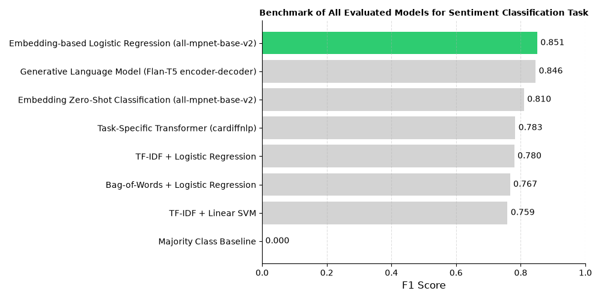

# LLM Text Classification Benchmark

<div align="center">

### From Classical Machine Learning to Transformer and Generative Models

A comprehensive benchmark comparing classical machine learning, transformer-based models, sentence embeddings and generative language models for sentiment classification task.

<br>



</div>

## Project Overview

Selecting an appropriate text classification model has become increasingly challenging with the rapid evolution of Natural Language Processing (NLP). While large language models (LLMs) have achieved remarkable performance across many tasks, traditional machine learning methods and specialized transformer models remain highly competitive for supervised text classification. This project aims to provide a systematic and reproducible benchmark of representative approaches spanning multiple generations of NLP techniques.

Using the **Rotten Tomatoes** sentiment analysis dataset, the project evaluates eight different classification approaches, ranging from simple statistical baselines to modern embedding-based and generative language models. All models are assessed under the same experimental setup using standard evaluation metrics, including **Accuracy**, **Precision**, **Recall**, and **F1-score**, enabling a fair and transparent comparison.

Beyond benchmarking model performance, this project emphasizes **reproducibility**, **clean software engineering practices**, and **modular experiment design**. The codebase is organized into reusable components for data preprocessing, model evaluation, visualization, and benchmarking, making it straightforward to extend the framework with additional datasets or models in future work.

### Models Evaluated

- Majority Class Baseline
- Bag-of-Words + Logistic Regression
- TF-IDF + Logistic Regression
- TF-IDF + Linear SVM
- Task-Specific Transformer (CardiffNLP RoBERTa)
- Embedding-based Logistic Regression (all-mpnet-base-v2)
- Embedding Zero-Shot Classification
- Generative Language Model (FLAN-T5)

### Project Objectives

- Compare classical machine learning and modern NLP approaches under a unified evaluation framework.
- Analyze the strengths and limitations of different text representations.
- Benchmark supervised, zero-shot, and generative classification strategies.
- Develop a reusable and extensible benchmarking framework for future NLP projects.
- Demonstrate reproducible machine learning workflows and best practices for research and production-oriented development.

## Repository Structure

The project follows a modular directory structure to separate data, source code, notebooks, and generated reports. This organization improves readability, reproducibility, and makes the framework easy to extend with additional models or datasets.

```text
llm-text-classification-benchmark/
│
├── config/                 # Configuration files
├── data/
│   ├── raw/                # Original datasets
├── notebooks/              # Jupyter notebooks for each experiment
├── reports/
│   ├── figures/            # Generated plots and visualizations
│   └── results/            # Benchmark tables and evaluation results
├── src/
│   ├── models/             # Model implementations
│   ├── baseline/           # Majority class baseline
│   ├── data_loader/        # Data loading and saving
│   ├── evaluation/         # Evaluation metrics 
├── pyproject.toml          # Project configuration
├── README.md               # Project documentation
├── requirements.txt        # Python dependencies
```
## Project Notebooks

The project is organized into three sequential Jupyter notebooks, each covering a specific stage of the project.

| Notebook | Description |
|----------|-------------|
| **[01_eda_rotten_tomatoes.ipynb](notebooks/01_eda_rotten_tomatoes.ipynb)** | Performs exploratory data analysis (EDA), including dataset statistics, review length analysis, vocabulary exploration, n-gram analysis, and class distribution. |
| **[02_baseline_models.ipynb](notebooks/02_baseline_models.ipynb)** | Implements and benchmarks classical machine learning approaches, including the Majority Class Baseline, Bag-of-Words, TF-IDF, Logistic Regression, and Linear SVM. |
| **[03_transformer_models.ipynb](notebooks/03_transformer_models.ipynb)** | Evaluates modern NLP approaches, including task-specific transformers, sentence embeddings, zero-shot embedding classification, and generative language models, followed by a unified benchmark comparison. |

## Benchmark Results

The figure below summarizes the performance of all evaluated models on the Rotten Tomatoes sentiment classification dataset. Models are ranked according to their **F1-score**, providing a direct comparison between classical machine learning methods, transformer-based approaches, sentence embedding models, and generative language models.

<div align="center">



**Figure 1.** Final benchmark comparison of all evaluated sentiment classification models.

</div>

## Key Takeaways

- Transformer-based semantic embeddings significantly outperform traditional bag-of-words representations.
- Lightweight classifiers combined with strong embeddings can achieve performance comparable to larger language models.
- Generative models such as Flan-T5 provide competitive results while offering greater flexibility for instruction-based tasks.
- Model evaluation should consider multiple metrics (accuracy, precision, recall, and F1-score) rather than accuracy alone.
- The best model depends not only on performance but also on computational cost, scalability, and deployment constraints.

## Installation

To set up the project environment, follow these steps:

0. Install uv if you haven't already:

```bash
# On macOS and Linux.
curl -LsSf https://astral.sh/uv/install.sh | sh
```

```bash
# On Windows.
powershell -ExecutionPolicy ByPass -c "irm https://astral.sh/uv/install.ps1 | iex"
```

```bash
# With pip.
pip install uv
```
1. Clone the repository:

```bash
git clone https://github.com/Alireza-Mirzadeh/llm-text-classification-benchmark.git

cd llm-text-classification-benchmark
```
2. Create a virtual environment and activate it:

```bash
uv venv

# Activate virtual environment

# macOS/Linux
source .venv/bin/activate

# Windows
.venv\Scripts\activate
```

3. Install the required dependencies:

```bash
uv sync
```
4. You can now run each notebook that you want to explore.

## Future Work

- Fine-tune transformer models on the Rotten Tomatoes dataset to assess performance improvements.
- Benchmark other Large Language Models (LLMs) and closed-source models for sentiment classification.
- Prompt engineering for generative models to improve classification accuracy.
- Run time and memory benchmarking for all models to evaluate efficiency and scalability.
- Ablation studies to understand the impact of different components

## Technologies


## References

[Rotten Tomatoes Movie Reviews Dataset](https://huggingface.co/datasets/cornell-movie-review-data/rotten_tomatoes)

[Hands-On Large Language Models Repository](https://github.com/handsOnLLM/Hands-On-Large-Language-Models)

[Flan-T5 Model Card](https://huggingface.co/google/flan-t5-small)

[CardiffNLP RoBERTa Model Card](https://huggingface.co/cardiffnlp/twitter-roberta-base-sentiment-latest)

[All-mpnet-base-v2 Model Card](https://huggingface.co/sentence-transformers/all-mpnet-base-v2)

[Hugging Face Transformers Documentation](https://huggingface.co/docs/transformers/index)

[Scikit-learn Documentation](https://scikit-learn.org/stable/)
